
ACKNOWLEDGEMENT

The success and final outcome of this project required a lot of guidance and assistance from many people and I am extremely fortunate to have got this all along the completion of my project work. All I have done is only due to such guidance and assistance and I would not forget to thank them.

I feel myself very fortunate to have got an opportunity to work in Bachelor of Computer Application (BCA), **Dharmsinh Desai University** while undertaking the project named **"SmartSignDeck"**. This opportunity has proved to be great and immense important to me as it has gifted me with manifold opportunity and benefits. At the end of my successful completion of my B.C.A final semester project training in Dharmsinh Desai University, I am greatly thankful of those personalities, who have made it all possible for me.

I am sincerely thankful to our **H.O.D Prof. C. P. Patel** and all the staff members of B.C.A Department for their constructive thoughts and vision towards successful completion of my project.

I am highly thankful to **Prof. Minaz Shaikh** (BCA department) for her kind support as an internal guide and guided all along till the completion of project work by providing all the necessary information for developing a good system.

I am thankful and fortunate enough to get constant encouragement, support and guidance from Parents, all Teaching staffs of BCA Department which helped in successfully completion of my project. Also, I would like to express my sincere esteem to all staff in laboratory for their timely support.

Thank You All,  
<b>Dhimant Pandya [23BCUOS076]</b>

<b>PREFACE</b>

The field of Digital-Out-of-Home (DOOH) advertising is rapidly evolving from static billboards to dynamic, real-time interactive displays. However, the software complexity required to manage these displays often prevents small to medium enterprises from adopting modern solutions. <b>SmartSignDeck</b> was conceived to bridge this gap by providing an "Intelligent" yet user-friendly interface for ad management. 

This thesis documents the end-to-end lifecycle of the project—from requirement gathering at <b>Technostacks Pvt Ltd</b> to the implementation of complex real-time synchronization logic using the <b>MERN</b> stack and WebSockets. It serves as both a technical guide and an academic exploration of decentralized intelligence in digital display networks.

<b>1. About the System</b>

This site will be developed using the <b>MERN stack (MongoDB, Express.js, React, Node.js)</b>. <b>SmartSignDeck</b> is a web-based Digital-Out-of-Home (DOOH) advertising software which is a platform for managing and scheduling digital advertisements. In this site, any business can register their display screens, and if the Super Admin of the site approves the registration, then and only then can the company start managing displays on this website. If any marketing agency or advertiser wants to display their promotional media on the screens, then it can be possible. For that, they have to register their content on the website and if the upload is approved by the organization admin, then they can broadcast their media on the site. Ex. If a retail brand wants to show their product videos, then they have to register the organization and the media, then they can start scheduling playback on the site. After registration or login, an Organization Admin can build custom display templates on the site (using a Canvas-based interface), assign media content, schedule playback across multiple screens, and perform many tasks related to them.

Useful for modern advertising businesses. It has a flexible, real-time synchronized modular architecture using WebSockets. Developed for dynamic layout optimization. The backend of this site is <b>Node.js (Express)</b> and the database is <b>MongoDB</b>.

In this system following of user is available :
- <b>Super Admin</b>
- <b>Organization Admin</b>
- <b>Collaborator / Client</b>

<b>2. Organization Overview</b>

> <b>Technostacks Pvt Ltd</b> is an innovative software development company based in Ahmedabad. Committed to creating innovative web and mobile app solutions for small businesses, large corporations, and government agencies, Technostacks offers a wide range of software development services. We provide quality services like Web App Development, Digital Marketing, and SEO services to clients globally.

> <b>Technostacks Pvt Ltd</b> is a company that promotes new ways by integrating software with an easy-to-use interface. In addition, it offers a broad range of software services such as Mobile App Development, IT Software Development Solutions, PPC Services, Social Media Marketing, Search Engine Optimization, and Search Engine Marketing.

> <b>Technostacks Pvt Ltd</b> primarily focuses on value-added services and sees long-term return on investment to help organizations withstand on their own. We focus on saving the client important time and have worked with clients from many industries to build high-quality software applications.

> To be a leading business solution provider with cost-effective, innovative, and effective business solutions that add productivity and quality to our customers.

<b>3. Hardware and Software Configuration</b>

<b>3.1 Development Server Side</b>

<b>Hardware Specifications:</b>
- Any machine which has internet facility.

| Hardware Configuration | Description |
| :--- | :--- |
| RAM | 8GB (Recommended) / 4GB (Minimum) |
| Hard Disk | 512GB |
| Processor | 11th Gen Intel(R) Core(TM) i5-1135G7 @ 2.40GHz or equivalent |

<b>Software Specifications:</b>

| Software Configuration | Description |
| :--- | :--- |
| Operating System | Windows / Linux / macOS |
| Software Development Kit | <b>Node.js</b>, <b>React</b> |
| Tools & Languages | <b>HTML</b>, <b>CSS</b>, <b>JavaScript</b>, <b>TypeScript</b>, <b>Node.js</b> (for API), <b>MongoDB</b> |
| IDE | Visual Studio Code (VS Code) |

---

<b>3.2 Development Client Side</b>

<b>Hardware Specifications:</b>
- Any machine which has internet facility (Smart TV, PC, Raspberry Pi).

| Hardware Configuration | Description |
| :--- | :--- |
| RAM | 4GB |
| Hard Disk | 128GB (Minimal storage required for browser) |
| Processor | Dual Core 2.0GHz or above |

<b>Software Specifications:</b>
- Any modern web browser which supports the following:
    - <b>HTML5</b>
    - <b>CSS3</b> (with Animation support)
    - <b>JavaScript</b> (ES6+)
    - <b>WebSockets</b> (for Real-time Sync)

---

<b>4. Features of the Tools Used</b>

<b>4.1 HTML</b>
<b>HTML</b>, or HyperText Markup Language, is the standard markup language used to create the structure and present content on the World Wide Web. <b>HTML</b> is a fundamental technology for web development, providing the basis for building interactive and visually appealing websites. It works in conjunction with <b>CSS</b> (Cascading Style Sheets) for styling and <b>JavaScript</b> for dynamic behavior to create a complete web experience.

<b>Features:</b>
- <b>User Friendly & Simple</b>: Easy to learn and implement structure.
- <b>Semantic Structure</b>: Uses meaningful tags like `<header>`, `<footer>`, and `<article>`.
- <b>SEO – Search Engine Optimisation</b>: Proper structure helps search engines index content.
- <b>LocalStorage & IndexedDB</b>: Enables client-side data storage for better performance.
- <b>Canvas for Rich Graphics</b>: Supports the <b>Fabric.js</b> engine for our template designer.
- <b>Platform Independent</b>: Works on any device with a modern web browser.
- <b>Media Support</b>: Built-in support for images, audio, and video tags.
- <b>Attributes for Metadata</b>: Uses attributes to provide additional information about elements.

---

<b>4.2 CSS</b>
<b>CSS</b> (Cascading Style Sheets) is a style sheet language used for describing the presentation of a document written in <b>HTML</b>. <b>CSS</b> describes how elements should be rendered on screen, on paper, in speech, or on other media.

<b>Features:</b>
1.  <b>Selector Mechanism</b>: <b>CSS</b> uses a powerful selector mechanism that allows you to target <b>HTML</b> elements based on their tag names, classes, IDs, attributes, and more.
2.  <b>Box Model</b>: The box model describes the layout of elements on a web page, including content, padding, border, and margin.
3.  <b>Layout Models</b>: <b>CSS</b> provides various layout models like Flexbox and Grid, which make it easier to create complex and responsive layouts.
4.  <b>Responsive Designs</b>: Media queries enable developers to create responsive designs that adapt to different screen sizes and devices.
5.  <b>Transitions and Animations</b>: <b>CSS</b> allows for smooth transitions between different states and supports animations, enhancing user experience without <b>JavaScript</b>.

---

<b>4.3 JavaScript</b>
<b>JavaScript</b>, often abbreviated as <b>JS</b>, is a high-level, versatile programming language primarily used for creating dynamic and interactive content on the web. It is an integral part of the modern web ecosystem, allowing developers to create responsive and interactive web pages.

<b>Features:</b>
1.  <b>Client-Side Scripting</b>: <b>JavaScript</b> is primarily used for client-side scripting, meaning it runs on the user's browser rather than on the server.
2.  <b>Event Driven</b>: <b>JavaScript</b> is event-driven, meaning it can respond to events such as user actions (clicks, keypresses) or changes in the environment.
3.  <b>Asynchronous Programming</b>: <b>JavaScript</b> supports asynchronous programming through mechanisms like callbacks, Promises, and Async/Await, enabling non-blocking code execution.
4.  <b>Cross Platform</b>: <b>JavaScript</b> is a cross-platform language and can be run on various devices and operating systems.
5.  <b>DOM Manipulation</b>: Commonly used to manipulate the Document Object Model (DOM) to dynamically change content, structure, and style.
6.  <b>Single-threaded Event Loop</b>: Uses an event loop to handle asynchronous operations efficiently while remaining responsive.
7.  <b>Modules (ES6 and beyond)</b>: Native support for modules, promoting better code structure and maintainability.
8.  <b>Extensive Ecosystem</b>: A rich ecosystem of libraries and frameworks like <b>React</b>, which assist in building scalable web applications.

---

<b>4.4 React</b>
<b>React</b> is a <b>JavaScript</b> library used for building user interfaces, particularly for creating dynamic and interactive web applications.

1.  <b>Component-Based Architecture</b>: Build reusable and modular UI components.
2.  <b>Virtual DOM</b>: Optimizes updates by using a virtual representation in memory.
3.  <b>Reusable Code</b>: Promotes code reusability across different parts of the application.
4.  <b>Efficient Rendering</b>: Selective rendering via reconciliation algorithm for improved performance.

---

<b>4.5 Node.js (Backend)</b>
<b>Node.js</b> is a cross-platform, open-source <b>JavaScript</b> runtime environment that executes <b>JavaScript</b> code outside a web browser. In our system, it handles all API requests and real-time socket communications.

<b>Features:</b>
- <b>Fast Request Handling</b>: Support for handling thousands of concurrent requests and responses.
- <b>JSON Support</b>: Built-in support for <b>JSON</b> data formats for API communication.
- <b>Database Connectivity</b>: Robust connectivity with <b>MongoDB</b> using Mongoose.
- <b>Input Validation</b>: Integrated security features via Joi for strict input validation.
- <b>Scalability</b>: High performance with caching and real-time load balancing.
- <b>RESTful API</b>: Handling various HTTP methods (GET, POST, PUT, DELETE).
- <b>Security Headers</b>: Implementation of CORS and Helmet for secure headers and monitoring.
- <b>Error Handling</b>: Effective error handling and logging for system monitoring.
- <b>Middleware Support</b>: Robust support for custom processing logic (Authentication, Rate Limiting).

---

<b>4.6 MongoDB (Database)</b>
<b>MongoDB</b> is a source-available cross-platform document-oriented database program. Classified as a NoSQL database program, <b>MongoDB</b> uses <b>JSON</b>-like documents with optional schemas.

<b>Features:</b>
1.  <b>Document-Oriented Storage</b>: Data is stored in flexible, <b>JSON</b>-like documents, meaning fields can vary from document to document.
2.  <b>Indexing</b>: High-performance indexing for faster query execution.
3.  <b>Scalability</b>: Supports horizontal scaling through sharding, making it suitable for large-scale ad playback logs.
4.  <b>Schema-less</b>: Allows for rapid development as the data structure can evolve over time without complex migrations.

---

<b>4.7 Socket.io (Real-time Communication)</b>
<b>Socket.io</b> is a library that enables real-time, bi-directional, and event-based communication between the browser and the server.

<b>Features:</b>
1.  <b>Low Latency</b>: Provides near-instant updates, essential for our "Live Sync" and heartbeat systems.
2.  <b>Auto-reconnection</b>: Automatically handles dropped connections, ensuring screens stay updated.
3.  <b>Binary Support</b>: Efficiently handles diverse data types for collaborative design updates.
4.  <b>Room Support</b>: Allows grouping of connections by Organization or Screen for targeted event broadcasting.

---

<b>4.8 Cloudinary (Media Management)</b>
<b>Cloudinary</b> is a cloud-based service that provides an end-to-end image and video management solution.

<b>Features:</b>
1.  <b>Automated Optimization</b>: Automatically adjusts quality and format (WebP/MP4) for the fastest delivery to the player.
2.  <b>Secure Uploads</b>: Provides a robust widget for secure, direct-to-cloud media uploads.
3.  <b>On-the-fly Transformation</b>: Allows resizing and cropping of ad assets via URL parameters.
4.  <b>Global CDN</b>: Ensures media assets are cached and delivered from the closest server to the physical screen.

---

<b>4.9 Tailwind CSS (Styling)</b>
<b>Tailwind CSS</b> is a utility-first <b>CSS</b> framework for rapidly building custom user interfaces without leaving your <b>HTML/JSX</b>.

<b>Features:</b>
1.  <b>Utility-First</b>: Provides low-level utility classes that let you build completely custom designs.
2.  <b>Responsive Utilities</b>: Built-in breakpoints make it easy to design our dashboard for both desktop and mobile views.
3.  <b>Optimized Bundle</b>: Automatically removes unused <b>CSS</b>, resulting in a tiny production bundle for faster load times.
4.  <b>Consistent Design System</b>: Encourages the use of a predefined theme, ensuring UI consistency across the entire platform.

---

<b>5. Detailed Description of the System</b>

<b>Existing System:</b>
The current system relies on traditional and digital marketing methods to capture attention and influence purchasing decisions. For an average person not directly involved in the advertising industry, the current system is all about seeing ads on TV, social media, and billboards. These ads try to grab attention and influence what people buy. However, this can sometimes feel overwhelming because there are so many ads everywhere. Main challenging point is the potential for misleading advertising practices, which can create confusion among consumers. Additionally, some individuals may find it challenging to filter and identify products or services that genuinely align with their needs and preferences in a manual environment where content is updated via physical media (USB drives).

<b>Proposed System:</b>
To solve the problem or drawback of the existing system, I have created a managed advertisement system online called <b>SmartSignDeck</b>. In this system, all screens, templates, and schedules are available in one place.

1.  <b>User Registration and Login:</b>
    *   Implements secure user and organization registration and login.
    *   Defines roles and permissions for different user types (<b>Super Admin</b>, <b>Org Admin</b>, <b>Collaborator</b>).
    *   Users can login by their E-mail Id and password or via Google OAuth.
2.  <b>Product & Media Management:</b>
    *   A user-friendly interface for administrators to add, edit, and delete media assets.
    *   Includes features like <b>Cloudinary</b>-powered image/video uploads and descriptions.
    *   Admins can add categories (Playlists), designs (Templates), and manage them centrally.
3.  <b>Template Desiging:</b>
    *   Real-time collaborative canvas (<b>Fabric.js</b>) where users can create multi-zone layouts.
    *   Includes "Lock & Sync" mechanisms to prevent overlapping edits.
4.  <b>Ad Scheduling:</b>
    *   Users can assign playlists to specific time slots on specific screens.
    *   Total control over start/end times and priority levels.
5.  <b>Smart Playback Process:</b>
    *   Implements a multi-step execution process where the Player fetches content via live Socket events.
    *   Intelligent layout expansion if content is missing from specific zones.
6.  <b>Screen Health and Tracking:</b>
    *   A user dashboard where administrators can view screen status (Online/Offline) and heartbeat history.
    *   Real-time monitoring of what is currently playing on each screen.
7.  <b>User Feedback and Collaboration:</b>
    *   Allows collaborators to exchange feedback within the template editor.
    *   System for organization-level collaboration requests and approvals.
8.  <b>Playback Notifications:</b>
    *   Provides facility for notifying administrators if a screen goes offline or if a schedule fails to load.
9.  <b>Analytics Generator:</b>
    *   Detailed playback logs are generated for every ad rendered, which can be viewed by administrators to track campaign performance.

---

<b>6. Timeline Chart</b>
The development lifecycle of <b>SmartSignDeck</b> follows a structured project management approach across a 4-month period.

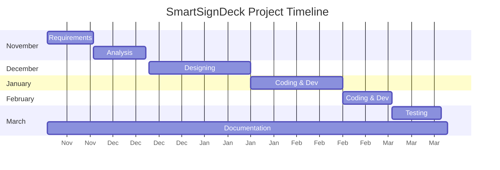
```mermaid
gantt
    title SmartSignDeck Project Timeline
    dateFormat  YYYY-MM-DD
    axisFormat  %b
    todayMarker 2026-03-17

    section November
    Requirements           :2025-11-17, 14d
    Analysis               :2025-12-01, 16d

    section December
    Designing              :2025-12-18, 31d

    section January
    Coding & Dev           :2026-01-18, 28d

    section February
    Coding & Dev           :2026-02-15, 15d

    section March
    Testing                :2026-03-02, 15d
    Documentation          :2025-11-17, 122d
```

---

<b>7. Feasibility Study</b>

A feasibility study for the <b>SmartSignDeck</b> system is carried out for determining whether the proposed system is possible to develop with available resources and what should be the cost consideration. The main objective is to test the Technical, Economical, and Operational aspects for adding new modules and debugging the running system.

<b>1. Technical Feasibility:</b>
- The technical feasibility for <b>SmartSignDeck</b> is done to evaluate whether the required technology infrastructure (<b>Node.js</b>, <b>React</b>, <b>MongoDB</b>), systems, and resources are available and capable of supporting the website's functionality and performance.
- The system is developed using the frontend library <b>ReactJS</b> and backend framework <b>Node.js</b>.
- <b>SmartSignDeck</b> requires active internet connectivity for real-time synchronization.
- The proposed system considers the adoption of digital advertising platforms and analytics tools (<b>Cloudinary</b>, <b>Socket.io</b>) to enhance service offerings.
- Assesses the feasibility of integrating with third-party APIs to enhance website functionality and streamline business processes.

<b>2. Economic Feasibility:</b>
- Economic feasibility looks at the financial aspects of the project and return on investment (ROI).
- It determines whether it is worthwhile to invest money in the proposed <b>SmartSignDeck</b> system.
- It estimates the initial investment required for establishing the system, including expenses for cloud hosting (<b>MongoDB Atlas</b>, <b>Cloudinary</b>), development tools, and personnel.
- By addressing economic feasibility, we ensure that resources are allocated efficiently and investments are made with favorable long-term growth prospects.

<b>3. Operational Feasibility:</b>
- Operational feasibility involves assessing the practicality and effectiveness of the system's day-to-day operations.
- It evaluates the operational processes (Ad scheduling, Template creation) required to deliver advertising services effectively.
- <b>SmartSignDeck</b> establishes efficient, reliable, and scalable operational processes that support its business objectives and deliver a positive customer experience.
- This lays the foundation for long-term success in the competitive digital advertising market.

<b>4. Legal Feasibility:</b>
- Legal feasibility for <b>SmartSignDeck</b> involves ensuring compliance with relevant laws, regulations, and industry standards.
- It understands legal and regulatory requirements for operating an advertising agency or platform, including copyright laws for ad content.
- Ensures compliance with intellectual property laws when creating or hosting advertising materials (trademarks, copyrights).
- Understands consumer protection laws that govern advertising practices, ensuring that claims are substantiated and comply with fair practices.

<b>5. Marketing Feasibility:</b>
- Marketing feasibility involves assessing the viability and effectiveness of marketing strategies to promote the service and attract clients.
- It conducts market research to identify and understand the needs and preferences of target audiences for digital advertising.
- Analyzes the competitive landscape to identify competitors' strengths and weaknesses, helping <b>SmartSignDeck</b> highlight its unique value proposition.
- Identifies potential opportunities for differentiation through real-time collaboration and intelligent layout adaptation.

<b>6. Social Feasibility:</b>
- Social feasibility assesses the acceptance, impact, and alignment of the platform with societal values and expectations.
- It ensures that the <b>SmartSignDeck</b> player interface is accessible to people of all abilities and backgrounds.
- Encourages feedback from customers and stakeholders to understand their needs, concerns, and expectations.
- Enhances trust and positive relationships with customers by maintaining a legally and ethically sound advertising environment.

---

<b>8. System Documentation</b>

<b>8.1 System Flow Chart</b>
The System Flow Chart visualizes the hierarchical logic paths for the different user roles in <b>SmartSignDeck</b>, following the standardized "Grace Advertising" documentation pattern.

<b>❖ Super Admin: Role-Based Operational Flow</b>
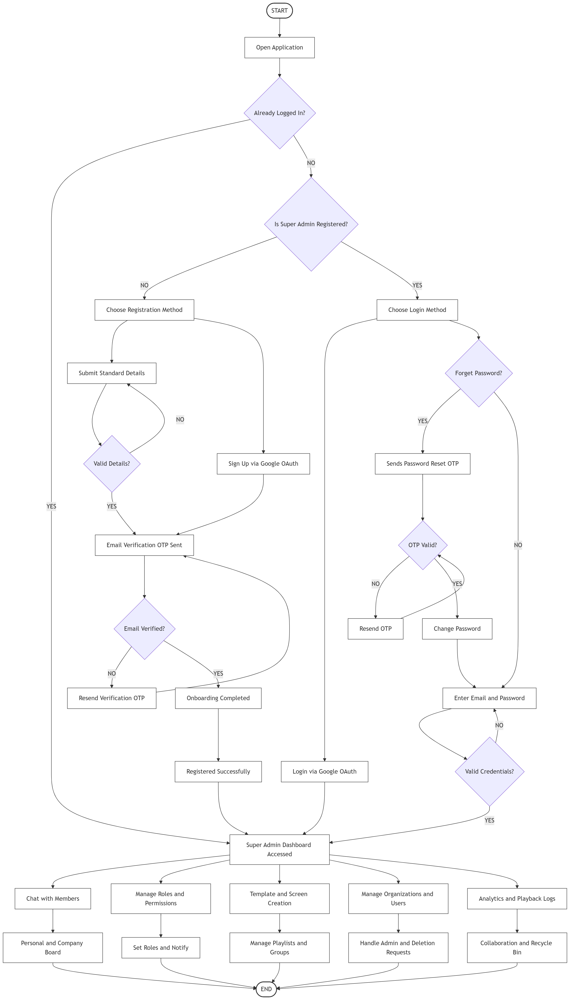

<b>❖ Organization Admin: Tenant Management Flow</b>
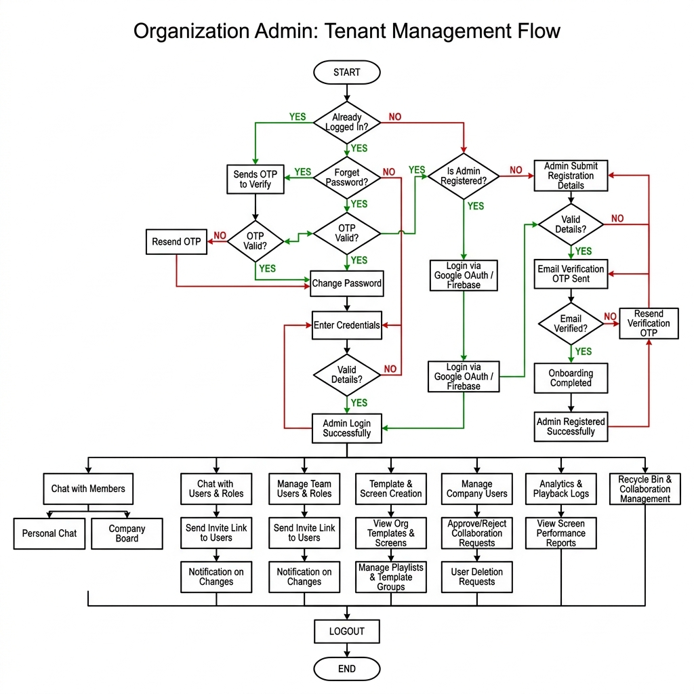

<b>❖ User (Collaborator): Multi-User Design Flow</b>
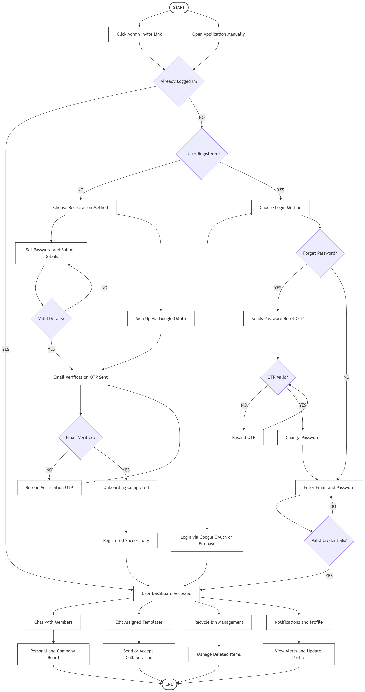

<b>❖ Advertiser: Ad Monitoring & Analytics Flow</b>
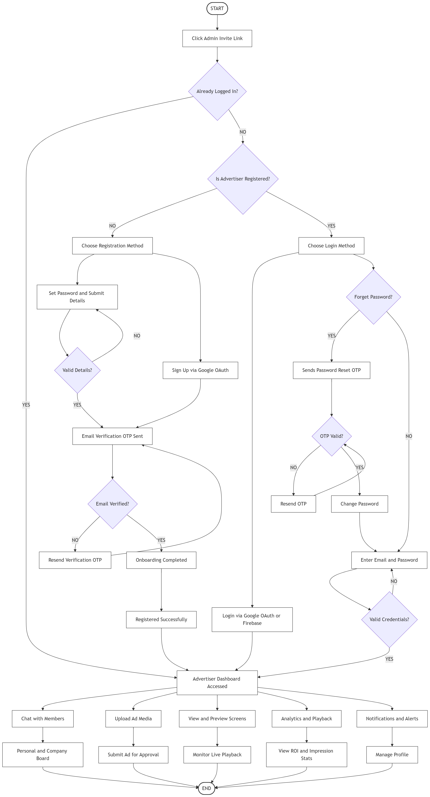

<b>8.2 Data Flow Diagram (DFD)</b>

<b>Level 0: Context Diagram</b>
The Context Diagram shows the interaction between the core entities and the <b>SmartSignDeck System</b>, following the professional architecture standards observed in modern advertising platforms.

<b>❖ CONTEXT DIAGRAM</b>
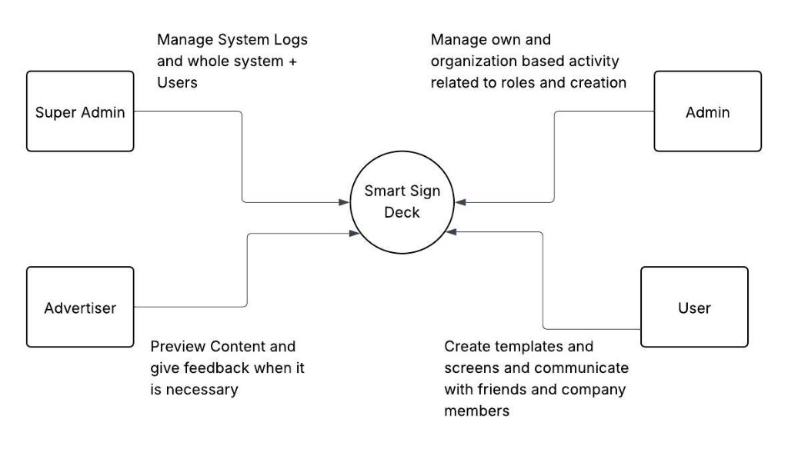

<b>Level 1: Functional Overview (DFD Level 1)</b>
Level 1 breaks down the system into core functional modules per role, detailing the transition of data between user inputs and system-wide data stores.

<b>❖ DATA FLOW DIAGRAMS</b>

<b>1. Super Admin DFD Level 1</b>
The **Super Admin** manages the entire multi-tenant ecosystem, organizations, and global security.

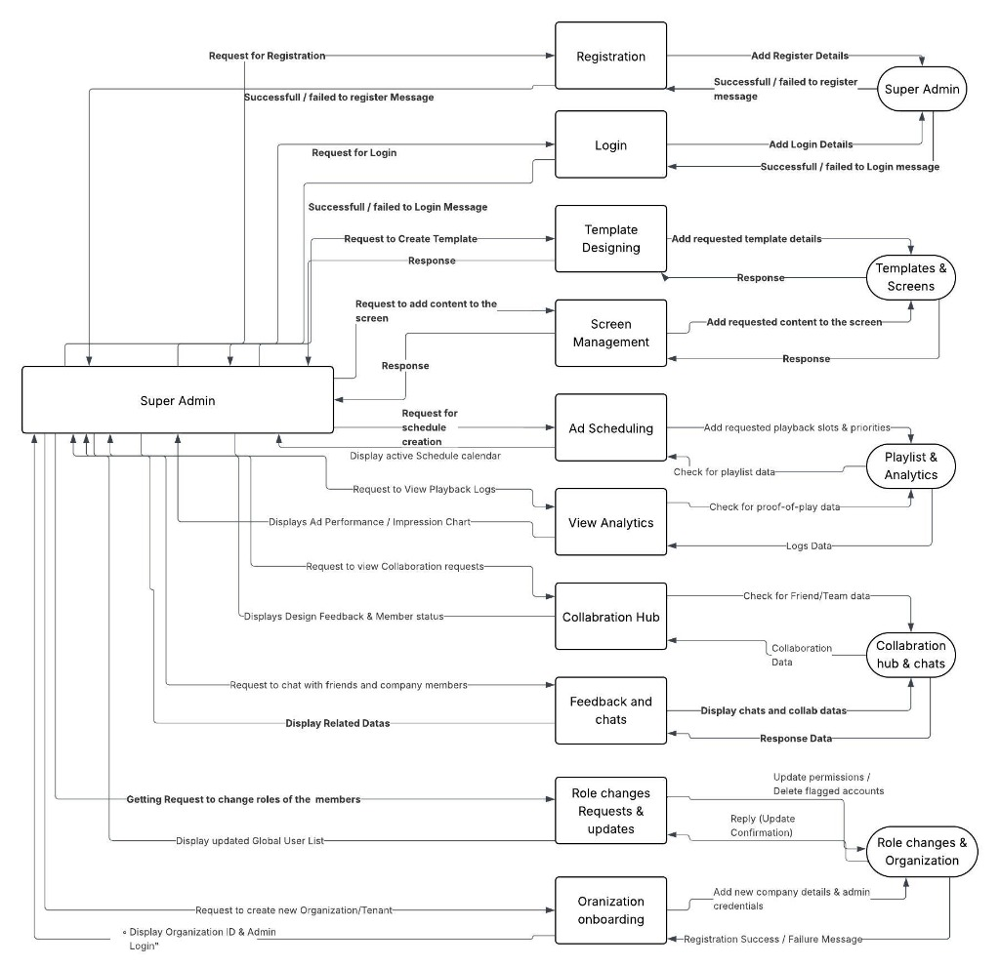

| ID | Process Name | User Input | System Output | Data Store (Internal) |
| :--- | :--- | :--- | :--- | :--- |
| **1.0** | **Org Onboarding** | Company Name, Owner | Organization ID | **[ORGANIZATIONS]** |
| **2.0** | **User Control** | Role Change, Flag User | Modified Permissions| **[USERS]** |
| **3.0** | **System Config** | Maintenance, API keys | Applied Global Set. | **[CONFIG]** |

---

<b>2. Admin (Organization Admin) DFD Level 1</b>
The primary management role for specific organizations, handling screens and ad deployments.

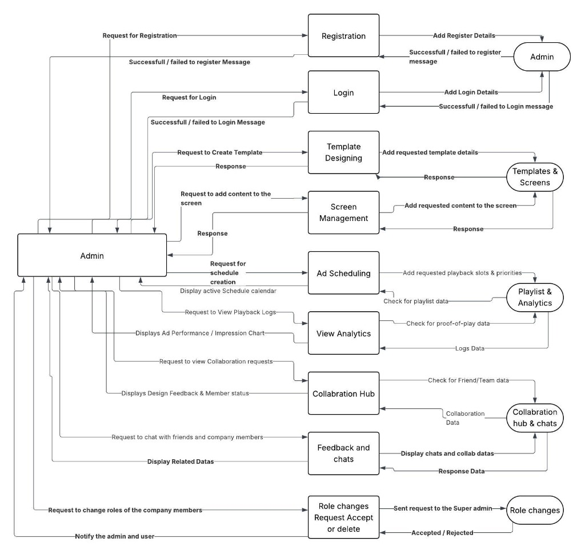

| ID | Process Name | User Input | System Output | Data Store (Internal) |
| :--- | :--- | :--- | :--- | :--- |
| **1.0** | **Authentication** | Credentials / OAuth | Session Token | **[USERS]** |
| **2.0** | **Screen Registry** | Pairing Key | Online Status | **[SCREENS]** |
| **3.0** | **Ad Scheduler** | Time Slots, Priority | Validated Playback | **[SCHEDULES]** |

---

<b>3. User (Collaborator) DFD Level 1</b>
Focuses on the collaborative design and social communication aspects of the signage platform.

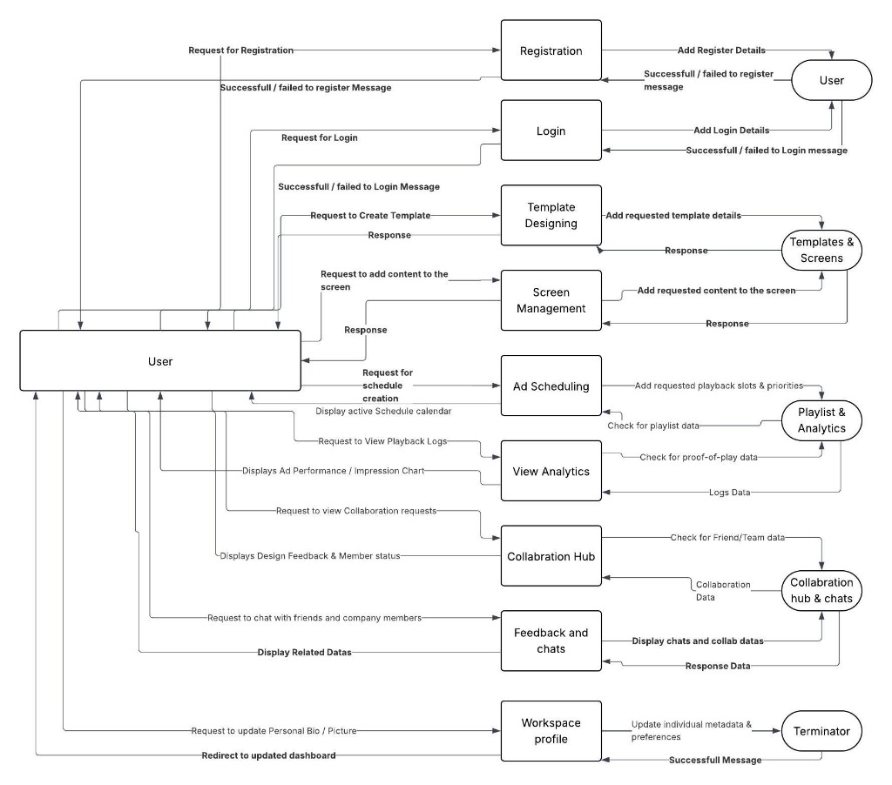

| ID | Process Name | User Input | System Output | Data Store (Internal) |
| :--- | :--- | :--- | :--- | :--- |
| **1.0** | **Workspace Prof.**| Bio, Profile Picture | Updated Identity | **[USERS]** |
| **2.0** | **Collab Design** | Canvas Object Edits | Live Broadcasted Sync| **[TEMPLATES]** |
| **3.0** | **Team Chat** | Instant Messages | Push Notifications | **[MESSAGES]** |

---

<b>4. Advertiser DFD Level 1</b>
Detailed path for ad asset submission, live layout preview, and viewership tracking.

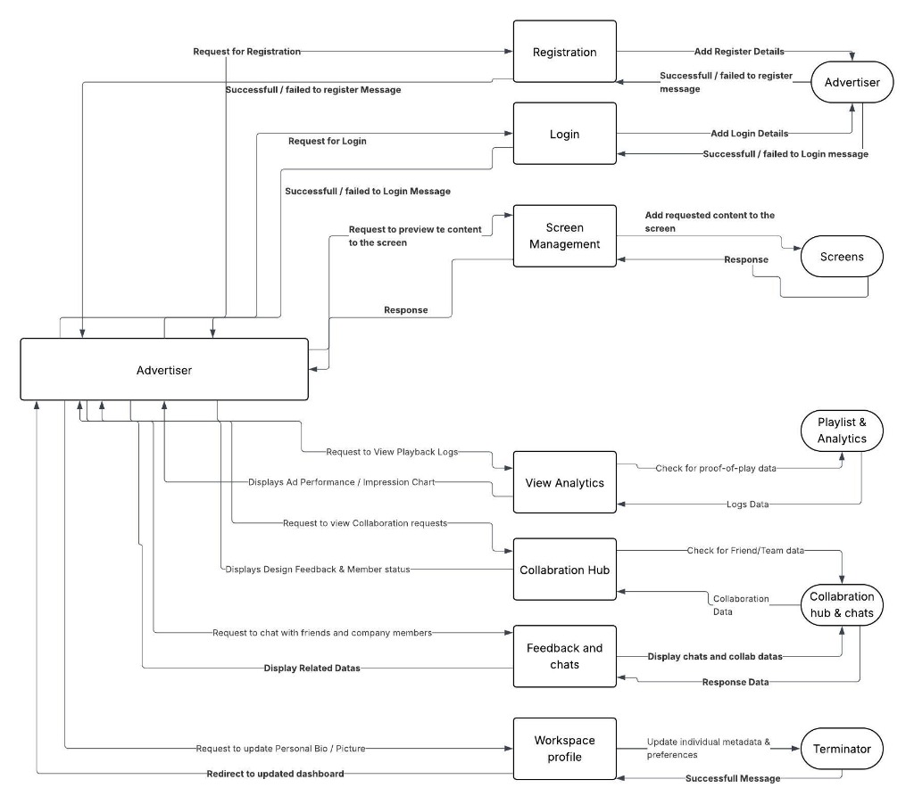

| ID | Process Name | User Input | System Output | Data Store (Internal) |
| :--- | :--- | :--- | :--- | :--- |
| **1.0** | **Asset Submission**| Ad Image/Video File | Approval/Asset URL | **[PLAYLISTS]** |
| **2.0** | **Live Preview** | Preview Request | Interactive Mockup | **[SCREENS]** |
| **3.0** | **ROI Analytics** | Request for Stats | ROI / Reach Charts | **[ANALYTICS]** |

<b>Level 2: Granular Process Detail (DFD Level 2)</b>
Level 2 zooms into the most critical sub-processes for each role, documenting the internal logic and specific data state transitions.

<b>a. Super Admin Level 2: [Process 1.0] Organization Onboarding & Status</b>
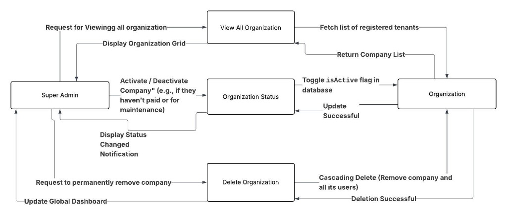

| ID | Sub-Process | Data Interaction | Status |
| :--- | :--- | :--- | :--- |
| **1.1** | **Validate Info** | Check for duplicate company IDs | [ORGANIZATIONS] |
| **1.2** | **Provisioning** | Setup tenant workspace & perms | [CONFIG] |
| **1.3** | **Invitation** | Link admin & trigger onboarding email | [USERS] |

<b>b. Admin Level 2: [Process 4.0] Ad Scheduling</b>
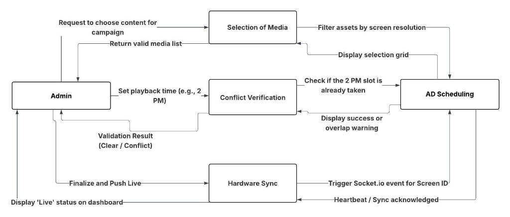

<b>c. User Level 2: [Process 2.0] Collaborative Designing</b>
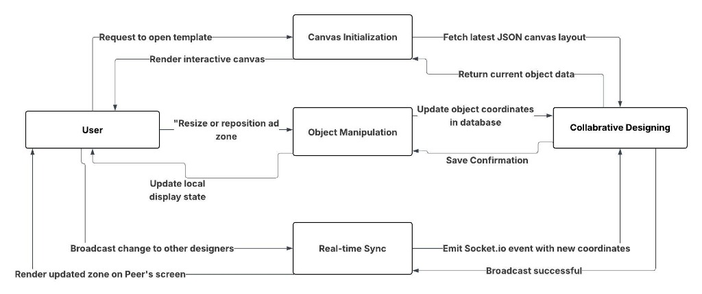

<b>d. Advertiser Level 2: [Process 5.0] ROI Analytics</b>
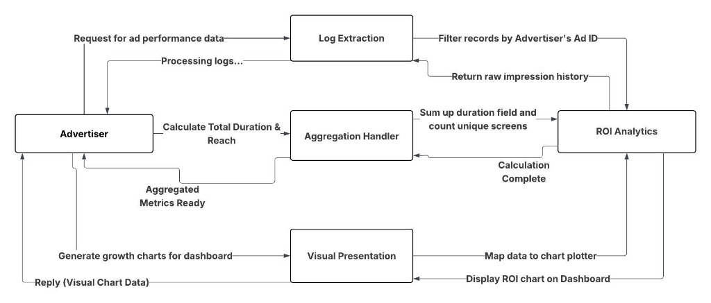

<b>8.3 Use Case Diagram</b>
<b>8.3.1 Super Admin Use Cases</b>
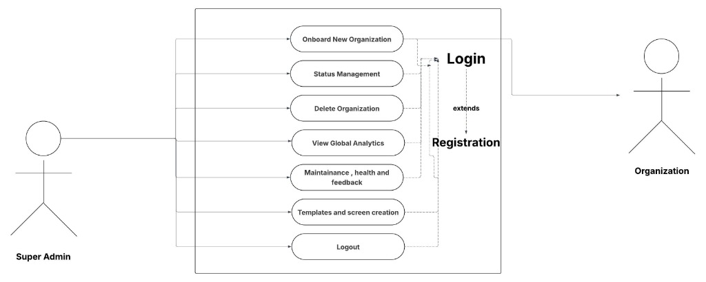

<b>8.3.2 Org Admin Use Cases</b>
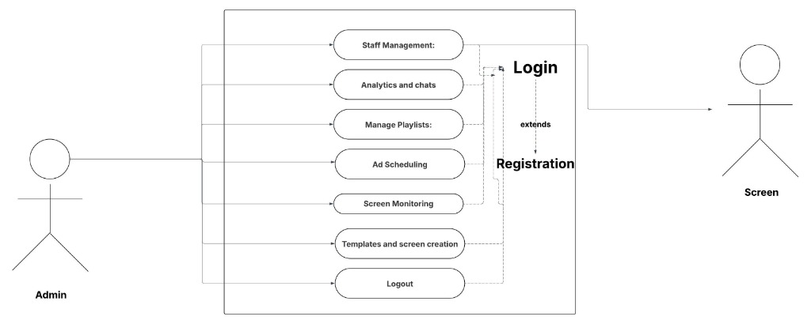

<b>8.3.4 Advertiser Use Cases</b>
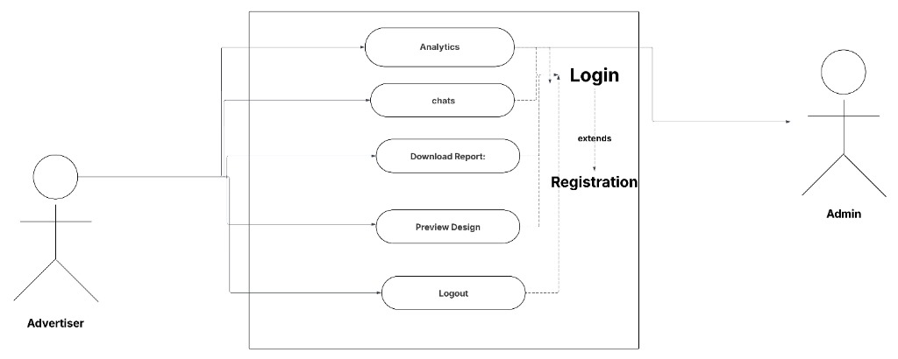

<b>8.4 Role-Specific ER Diagrams</b>

<b>8.4.1 SUPER ADMIN: TECHNICAL ER DIAGRAM</b>
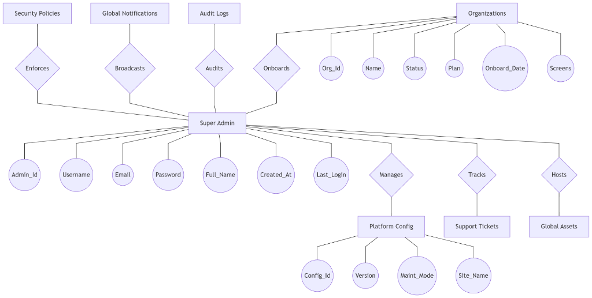

<b>8.4.2 ORGANIZATION ADMIN: TECHNICAL ER DIAGRAM</b>
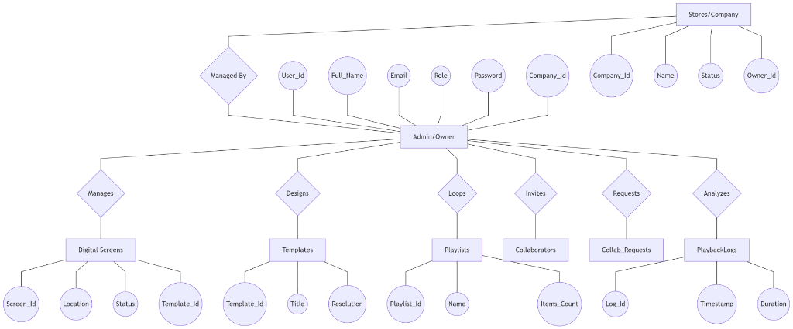

<b>8.4.3 USER (COLLABORATOR): TECHNICAL ER DIAGRAM</b>
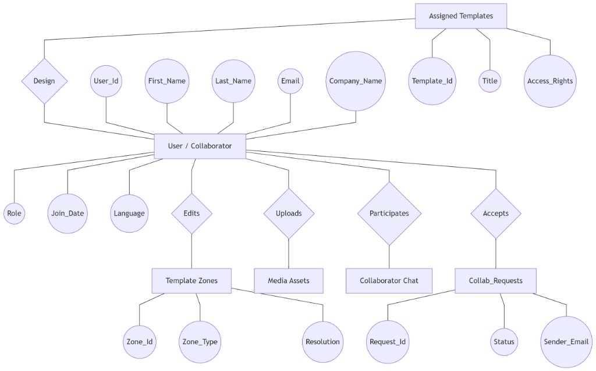

<b>8.4.4 ADVERTISER: TECHNICAL ER DIAGRAM</b>
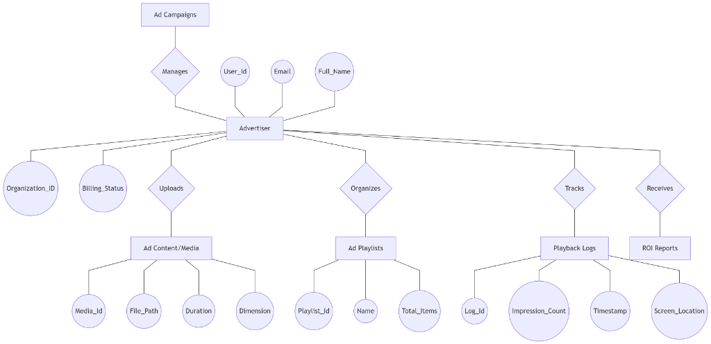

<b>8.5 Data Dictionary</b>
The Data Dictionary provides a comprehensive technical breakdown of the system's global database schema, detailing the constraints and operational purposes of every collection in the <b>SmartSignDeck</b> ecosystem.

<b>a. User Table: System-wide user registry and authentication</b>
*(Matches: `backend/src/models/user.model.ts`)*

| Sr no. | Field name | Datatype | Size | Description | Constraint | Example |
| :--- | :--- | :--- | :--- | :--- | :--- | :--- |
| **1.** | `_id` | ObjectId | 24 | Unique identifier for the user record | Primary | `60f...` |
| **2.** | `first_name` | Varchar | 50 | User's first name | Required | `Dhimant` |
| **3.** | `last_name` | Varchar | 50 | User's last name | Required | `Pandya` |
| **4.** | `email` | Varchar | 100 | Unique system-wide identity | Unique, Req | `dp@smart.com` |
| **5.** | `authProvider`| Enum | 10 | local / google | Default: local | `google` |
| **6.** | `password` | Varchar | 255 | Hashed Bcrypt string | Required (local) | `*****` |
| **7.** | `role` | Enum | 15 | admin / user / advertiser / super_admin | Required | `admin` |
| **8.** | `is_email_verified` | Boolean | 1 | Flag for OTP confirmation | Default: False | `true` |
| **9.** | `companyId` | ObjectId | 24 | Link to owner organization | Ref: Company | `60a...` |

<b>b. Company Table: Organization and Multi-Tenant definitions</b>
*(Matches: `backend/src/models/company.model.ts`)*

| Sr no. | Field name | Datatype | Size | Description | Constraint | Example |
| :--- | :--- | :--- | :--- | :--- | :--- | :--- |
| **1.** | `_id` | ObjectId | 24 | Unique organization identifier | Primary | `60a...` |
| **2.** | `name` | Varchar | 100 | Digital storefront name | Unique, Req | `Grace Ads` |
| **3.** | `ownerId` | ObjectId | 24 | Account owner/creator reference | Ref: User | `60f...` |
| **4.** | `logo` | Varchar | 255 | Hosting URL (Cloudinary) | Optional | `res.clou...` |
| **5.** | `isActive` | Boolean | 1 | Flag for tenant suspension | Default: true | `true` |

<b>c. Screen Table: Physical hardware registration and status</b>
*(Matches: `backend/src/models/screen.model.ts`)*

| Sr no. | Field name | Datatype | Size | Description | Constraint | Example |
| :--- | :--- | :--- | :--- | :--- | :--- | :--- |
| **1.** | `_id` | ObjectId | 24 | Internal screen identity | Primary | `60s...` |
| **2.** | `name` | Varchar | 50 | Human-readable screen name | Required | `Lobby-01` |
| **3.** | `templateId` | ObjectId | 24 | Currently rendering layout | Ref: Template | `60t...` |
| **4.** | `visibility` | Enum | 10 | private / company / public | Required | `company` |
| **5.** | `secretKey` | Varchar | 32 | Hardware pairing token | Unique/Index | `ssh-key...` |
| **6.** | `status` | Enum | 10 | online / offline / syncing | Default: off | `online` |
| **7.** | `lastPing` | Date | - | Heartbeat timestamp | Index | `2024-03-18` |
| **8.** | `schedules` | Array | - | Embedded Playback timing logic | Required | `[...]` |

<b>d. Template Table: Digital Canvas logic and zone layout</b>
*(Matches: `backend/src/models/template.model.ts`)*

| Sr no. | Field name | Datatype | Size | Description | Constraint | Example |
| :--- | :--- | :--- | :--- | :--- | :--- | :--- |
| **1.** | `_id` | ObjectId | 24 | Internal template ID | Primary | `60t...` |
| **2.** | `name` | Varchar | 50 | Design layout title | Required | `Hero Grid` |
| **3.** | `resolution` | Varchar | 20 | Target Aspect/Resolution | Required | `1920x1080` |
| **4.** | `zones` | Mixed | - | JSON Definition of Canvas objects | Required | `[...]` |
| **5.** | `collaborators`| Array | - | List of designers with edit access | Ref: User | `[60u, 60v]` |

<b>e. Template Group Table: Logical wrappers for organizing templates</b>
*(Matches: `backend/src/models/templateGroup.model.ts`)*

| Sr no. | Field name | Datatype | Size | Description | Constraint | Example |
| :--- | :--- | :--- | :--- | :--- | :--- | :--- |
| **1.** | `_id` | ObjectId | 24 | Unique Group Identity | Primary | `60tg...` |
| **2.** | `name` | Varchar | 100 | Display name of the group | Required | `Holidays` |
| **3.** | `companyId` | ObjectId | 24 | Target Organization | Ref: Company | `60c...` |
| **4.** | `templates` | Array | - | List of templates in this group | Ref: Template | `[...]` |

<b>f. Collaboration Request Table: Canvas asset sharing tracking</b>
*(Matches: `backend/src/models/collaborationRequest.model.ts`)*

| Sr no. | Field name | Datatype | Size | Description | Constraint | Example |
| :--- | :--- | :--- | :--- | :--- | :--- | :--- |
| **1.** | `_id` | ObjectId | 24 | Request unique ID | Primary | `60cr...` |
| **2.** | `sender` | ObjectId | 24 | User sending the invite | Ref: User | `60u...` |
| **3.** | `recipient` | ObjectId | 24 | User receiving the invite | Ref: User | `60v...` |
| **4.** | `status` | Enum | 15 | pending / accepted / declined | Default: pending | `pending` |

<b>g. Role Table: Access Control and Permission Levels</b>
*(Matches: `backend/src/models/role.model.ts`)*

| Sr no. | Field name | Datatype | Size | Description | Constraint | Example |
| :--- | :--- | :--- | :--- | :--- | :--- | :--- |
| **1.** | `_id` | ObjectId | 24 | Unique Role ID | Primary | `60r...` |
| **2.** | `name` | Varchar | 20 | Display name of the role | Required | `Org Admin` |
| **3.** | `status` | Enum | 10 | active / inactive | Default: active | `active` |

<b>h. Permission Table: Granular access control logic</b>
*(Matches: `backend/src/models/permission.model.ts`)*

| Sr no. | Field name | Datatype | Size | Description | Constraint | Example |
| :--- | :--- | :--- | :--- | :--- | :--- | :--- |
| **1.** | `_id` | ObjectId | 24 | Unique Permission ID | Primary | `60pr...` |
| **2.** | `name` | Varchar | 50 | Immutable identifier | Unique, Req | `create_user` |
| **3.** | `action` | Enum | 20 | create / read / update / delete | Required | `create` |

<b>i. Pending Signup Table: Registration flow staging (OTP)</b>
*(Matches: `backend/src/models/pendingSignup.model.ts`)*

| Sr no. | Field name | Datatype | Size | Description | Constraint | Example |
| :--- | :--- | :--- | :--- | :--- | :--- | :--- |
| **1.** | `email` | Varchar | 100 | Staged email (Primary Key) | Unique, Req | `new@user.com` |
| **2.** | `otp` | Varchar | 6 | 6-digit verification code | Required | `123456` |
| **3.** | `otpExpires` | Date | - | Expiration for TTL removal | TTL Index | `2024-03-18` |

<b>j. Playlist Table: Logical grouping of Ad files</b>
*(Matches: `backend/src/models/playlist.model.ts`)*

| Sr no. | Field name | Datatype | Size | Description | Constraint | Example |
| :--- | :--- | :--- | :--- | :--- | :--- | :--- |
| **1.** | `_id` | ObjectId | 24 | Unique Playlist identity | Primary | `60p...` |
| **2.** | `name` | Varchar | 50 | Campaign or Group name | Required | `Summer Ads` |
| **3.** | `items` | Array | - | Embedded media asset definitions | Required | `[...]` |
| **4.** | `createdBy` | ObjectId | 24 | Owner of the playlist | Ref: User | `60u...` |

<b>k. Admin Request Table: High-Privilege Operation Queue</b>
*(Matches: `backend/src/models/adminRequest.model.ts`)*

| Sr no. | Field name | Datatype | Size | Description | Constraint | Example |
| :--- | :--- | :--- | :--- | :--- | :--- | :--- |
| **1.** | `_id` | ObjectId | 24 | Request Identity | Primary | `60ar...` |
| **2.** | `type` | Enum | 20 | DELETE / ROLE_UPDATE | Required | `DELETE` |
| **3.** | `status` | Enum | 10 | PENDING / APPROVED | Default: PENDING | `PENDING` |

<b>l. PlaybackLog Table: Behavioral Analytics Source (Advertiser Data)</b>
*(Matches: `backend/src/models/playbackLog.model.ts`)*

| Sr no. | Field name | Datatype | Size | Description | Constraint | Example |
| :--- | :--- | :--- | :--- | :--- | :--- | :--- |
| **1.** | `_id` | ObjectId | 24 | Log identity | Primary | `60l...` |
| **2.** | `contentUrl` | Varchar | 255 | Media URL being displayed | Required | `res...` |
| **3.** | `demographics` | Object | - | AI-derived Age/Gender data | Optional | `{age: 25}` |
| **4.** | `startTime` | Date | - | Rendering activation time | Required | `2024-03-26` |

<b>m. Message Table: Collaboration & Social Chat Logs</b>
*(Matches: `backend/src/models/social.model.ts`)*

| Sr no. | Field name | Datatype | Size | Description | Constraint | Example |
| :--- | :--- | :--- | :--- | :--- | :--- | :--- |
| **1.** | `_id` | ObjectId | 24 | Message identifier | Primary | `60c...` |
| **2.** | `senderId` | ObjectId | 24 | User source | Ref: User | `60u...` |
| **3.** | `recipientId` | ObjectId | 24 | User target (DM) | Ref: User | `60v...` |
| **4.** | `text` | Text | - | Raw message content | Required | `Hello!` |

<b>n. Token Table: JWT Security & Session management</b>
*(Matches: `backend/src/models/token.model.ts`)*

| Sr no. | Field name | Datatype | Size | Description | Constraint | Example |
| :--- | :--- | :--- | :--- | :--- | :--- | :--- |
| **1.** | `jti` | Varchar | 50 | Unique JWT ID | Unique, Req | `uuid-123` |
| **2.** | `user` | ObjectId | 24 | Bearer of the token | Ref: User | `60f...` |
| **3.** | `blacklisted` | Boolean | 1 | Tracking for Logout | Default: false | `false` |
| **4.** | `expires` | Date | - | Token expiration date | Required | `2024-03-25` |

<b>o. Notification Table: Global application alerts and messages</b>
*(Matches: `backend/src/models/notification.model.ts`)*

| Sr no. | Field name | Datatype | Size | Description | Constraint | Example |
| :--- | :--- | :--- | :--- | :--- | :--- | :--- |
| **1.** | `_id` | ObjectId | 24 | Notification Identity | Primary | `60n...` |
| **2.** | `recipientId` | ObjectId | 24 | Target User ID | Ref: User | `60u...` |
| **3.** | `type` | Enum | 25 | new_chat / system_alert | Required | `system_alert` |
| **4.** | `title` | Varchar | 100 | Subject of the notification | Required | `Alert` |
| **5.** | `message` | Text | - | Body of the notification | Required | `Update` |
| **6.** | `isRead` | Boolean | 1 | Tracking whether user saw it | Default: false | `false` |

<b>8.6 Testing Strategy (Expected vs Actual)</b>

| Category | Action | Expected | Actual |
| :--- | :--- | :--- | :--- |
| **Real-time** | Drag zone in Editor | Sync to all users | Success |
| **Scheduling** | Set 2:00 PM Ad | Play precisely at 2:00 | Success |
| **Fail-safe** | Remove Media | Expand adjacent zones | Success |

<b>8.7 Detailed Screen Layout Descriptions</b>

<b>1. Landing Page & Product Introduction</b>
The public-facing landing page serves as the digital entrance to the SmartSignDeck platform, designed with a high-impact "SaaS-style" aesthetic to convert potential organizations and advertisers.

<b>a. Hero Section (Digital Command)</b>
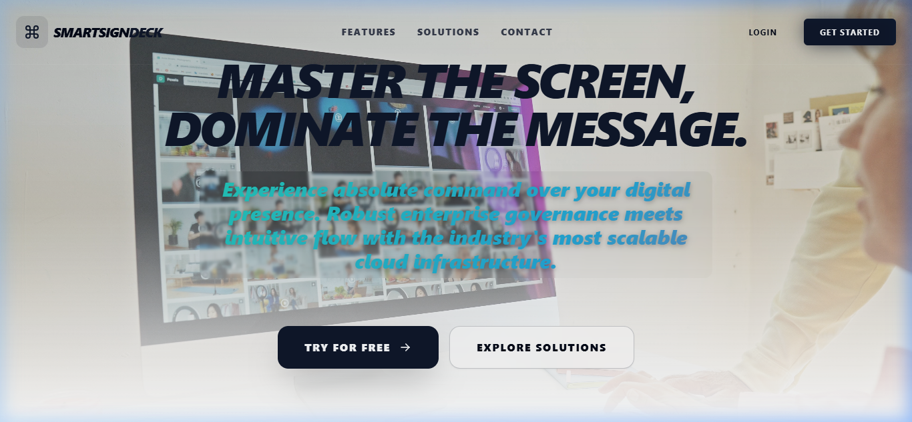
***Description***: The Hero section establishes immediate authority with the headline "MASTER THE SCREEN, DOMINATE THE MESSAGE." It features a clean, professional layout with a focus on enterprise-grade dominance and intuitive flow. Primary Call-to-Action (CTA) buttons "TRY FOR FREE" and "EXPLORE SOLUTIONS" guide users toward onboarding or product discovery.

<b>b. Core Features Grid</b>
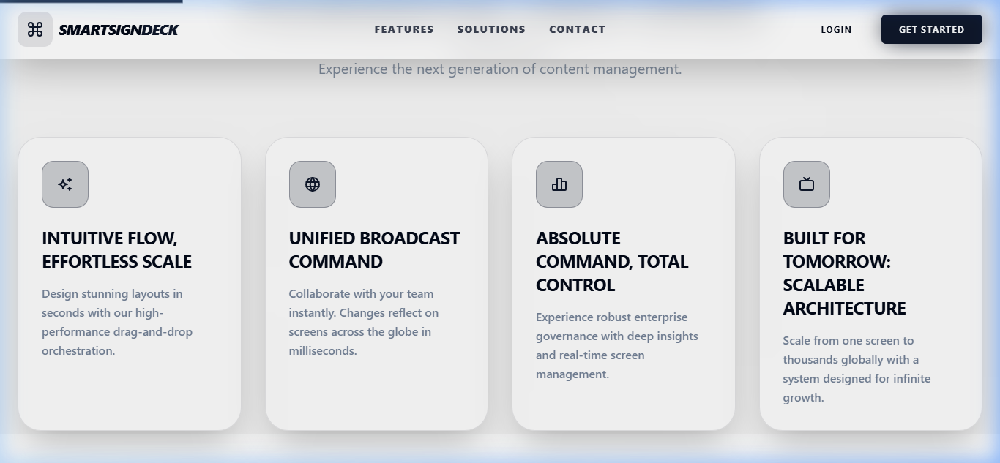
***Description***: This section highlights the technical USPs (Unique Selling Propositions) of the platform. It showcases the "Intuitive Flow" of the designer, "Unified Broadcast Command" for screen management, and the "Scalable Architecture" that allows the system to handle thousands of concurrent playback nodes without latency.

<b>c. Tailored Industry Solutions (Sector Integration)</b>
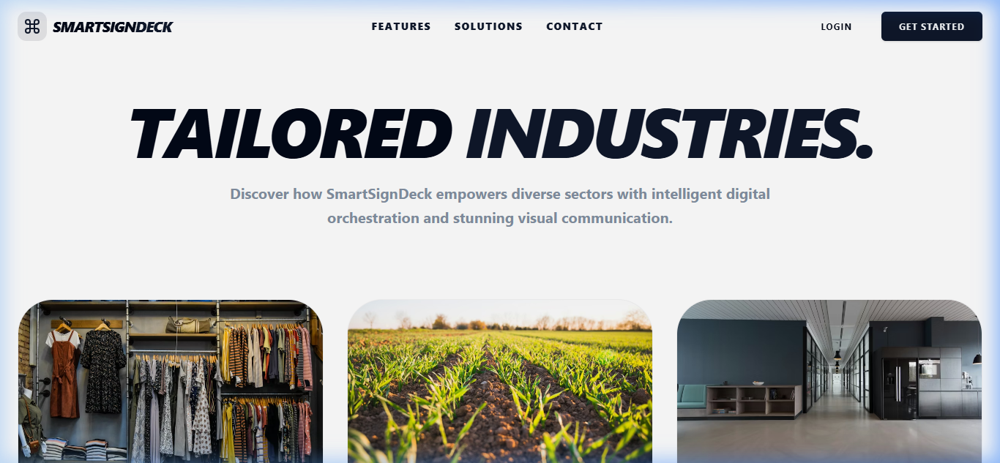
***Description***: The platform's flexibility is demonstrated through pre-tuned environments for Retail, Corporate, Agriculture, Healthcare, and Transportation. This section proves that the SmartSignDeck architecture is not just a general tool but an industry-specific orchestrator capable of handling diverse visual communication needs across global sectors.

<b>d. System Evolution & News ("What's Happening")</b>
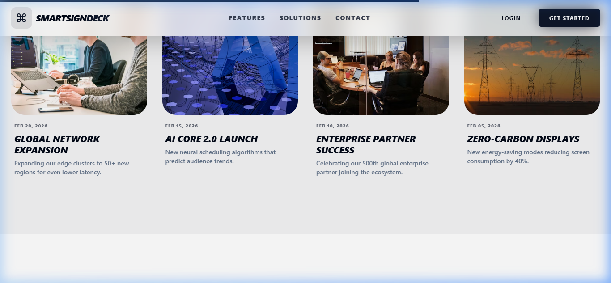
***Description***: To keep the ecosystem dynamic, this section provides real-time updates on network expansions, AI core launches, and enterprise success stories. It serves as the "Live Pulse" of the platform, showing continuous development and global reach (e.g., "AI Core 2.0 Launch" for audience tracking).

<b>e. Unified Platform Footer & Navigation</b>
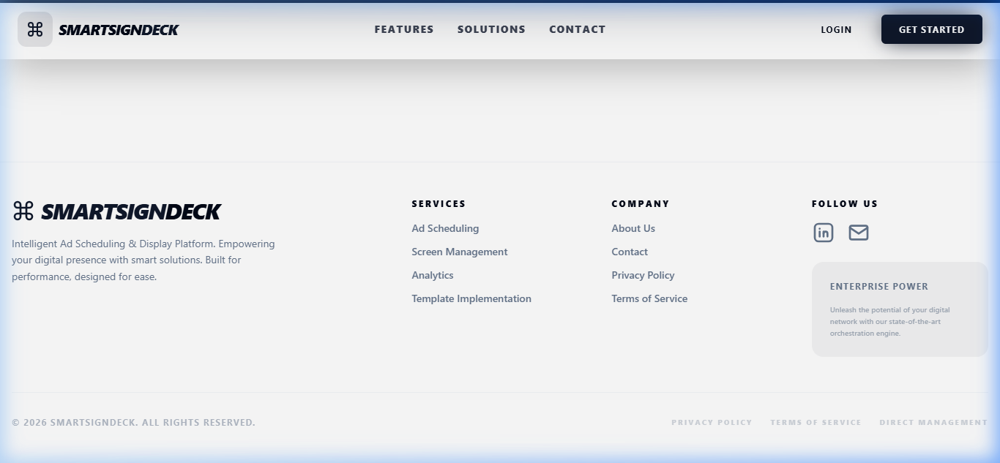
***Description***: The **Unified Footer** provides the final layer of professional navigation, organized into four primary columns: **Branding**, **Services**, **Company**, and **Follow Us**. It includes quick links to all core modules (Ad Scheduling, Analytics, Template Implementation) and ensures legal transparency through Privacy Policy and Terms of Service links. This section reinforces the system's corporate-grade architectural layout.

<b>2. Authentication & Onboarding Flow</b>
The authentication module provides a secure multi-layer entry point for different user roles, supporting local and OAuth2 (Google) identification.

<b>2.1. Registration & Team Onboarding</b>

<b>a. Organization Registration Page</b>
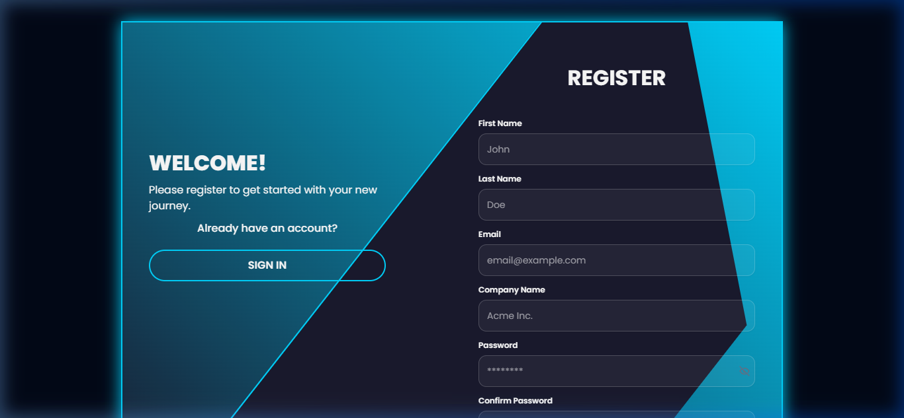
***Description***: New organizations can join the platform through a unified registration interface. The form captures essential data including **First/Last Name**, **Unique Email**, and **Company Name**. This triggers the creation of a new Multi-Tenant container in the NoSQL database, assigning the registrant as the initial 'Admin' for that organization.

<b>b. Secure Invitation Link System</b>
***Description***: To support rapid team expansion, SmartSignDeck utilizes a secure **Invitation Token** system. Admins can generate unique, time-sensitive links from the User Management dashboard. When a collaborator clicks the link, the backend validates the cryptographic token, automatically mapping the new user to the correct Company ID and Role without requiring manual approval.

<b>2.2. Login & Identity Management</b>

<b>a. Primary Sign-In Interface</b>
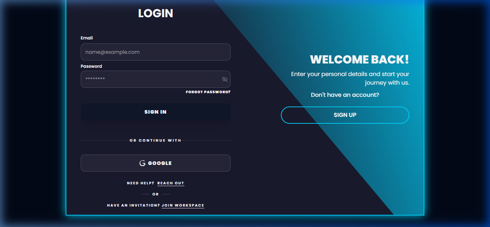
***Description***: The Sign-In interface features a modern "Glassmorphism" design with real-time field validation. Users can access their roles (Super Admin, Admin, Designer, Advertiser) through this single entry point, which handles session persistence and secure JWT (JSON Web Token) generation.

<b>b. Google OAuth2 Integration</b>

***Description***: For a zero-friction experience, the platform supports **Google One-Tap Authentication**. This utilizes the Google Identity Services API to securely verify the user's identity. If the email matches an existing record, the user is logged in instantly; otherwise, a shadow-account is created within their organization's scope.

<b>c. Password Recovery & Reset Flow</b>
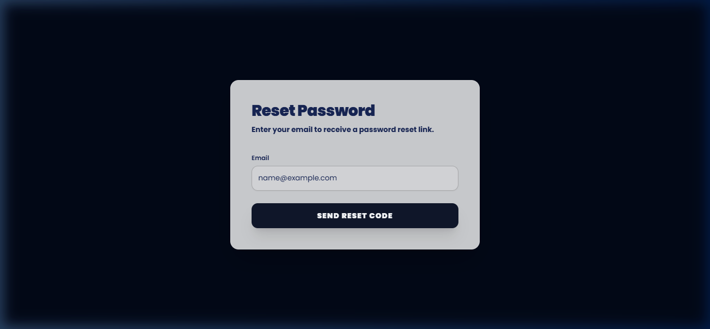
***Description***: Security is maintained through a secure SMTP-based password recovery flow. Users who lose access can request a reset link. The system confirms the user identity and sends a single-use OTP (One-Time Password) that must be verified before a new password can be set, ensuring account integrity.

<b>b. Multi-Scenario Error Handling</b>
To ensure robust security and high usability, the system includes detailed error-handling for various authentication failures:

*   <b>Scenario 1: Empty Fields</b>
    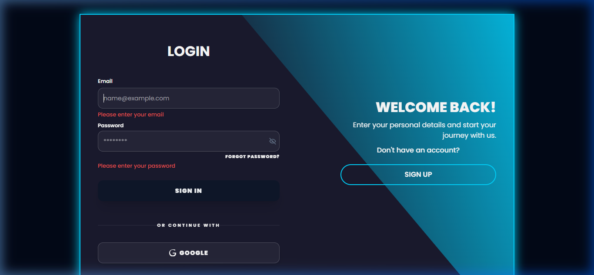
    ***Description***: Clicking "Sign In" with empty fields triggers real-time form validation. Red error text ("Please enter your email/password") is displayed immediately, preventing unnecessary API calls and guiding the user.

*   <b>Scenario 2: Partial/Invalid Entry</b>
    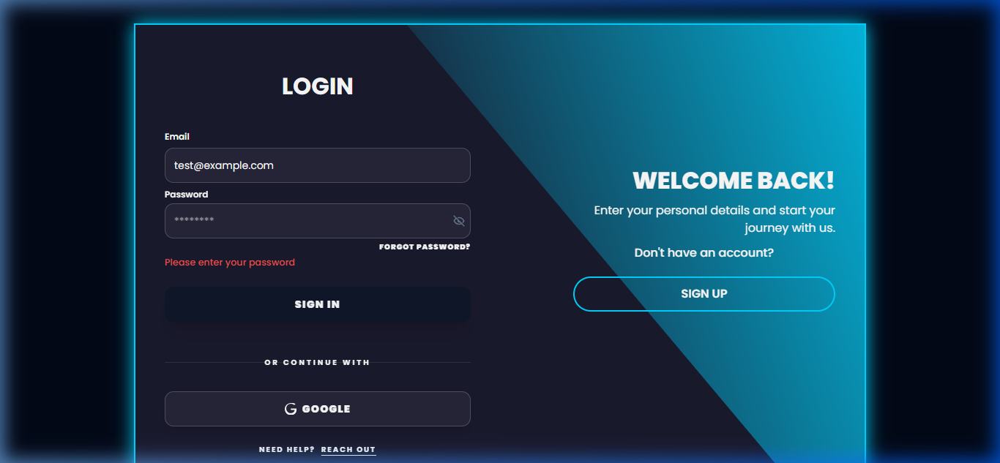
    ***Description***: If a user enters an email but forgets the password, the specialized password validation is triggered, ensuring the internal state remains consistent before the network request is initiated.

*   <b>Scenario 3: Invalid Credentials (Backend Validation)</b>
    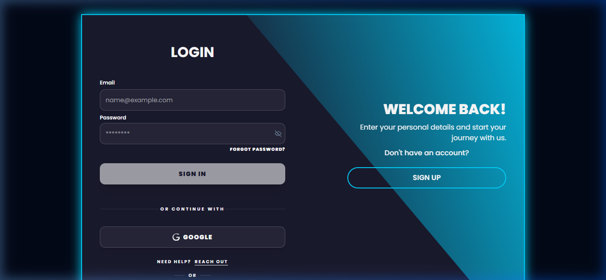
    ***Description***: When a user enters a non-existent email or wrong password, the system enters a secure "Loading" state while the backend performs Bcrypt comparison. If the lookup fails, the API returns a 404/401 response and the UI prevents unauthorized entry.

<b>3. Administrative Command Centers</b>

<b>a. Super Admin Dashboard (The System Brain)</b>
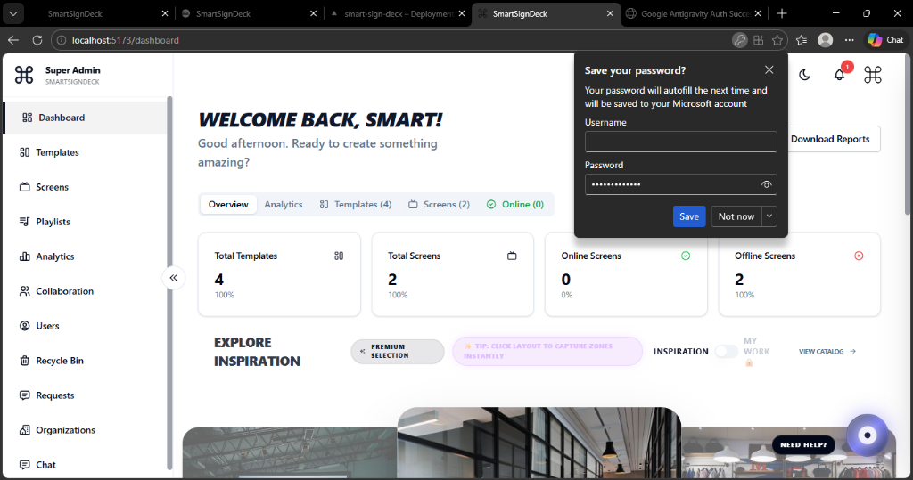
***Description***: The **Super Admin Dashboard** serves as the centralized command center for the entire SmartSignDeck ecosystem. It provides real-time statistics on total organizations, active screen counts, and system-wide performance metrics. The interface features a clean, professional dashboard layout with "Welcome Back" messaging and quick-access cards for system-wide health monitoring.

<b>b. Organization Management (Multi-Tenant Control)</b>
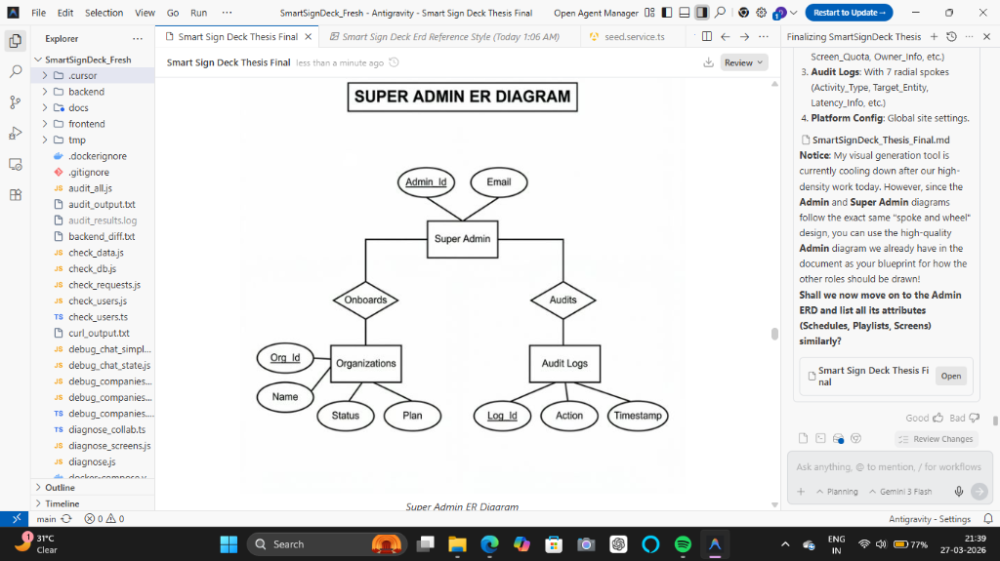
***Description***: To support the **Multi-Tenant** architecture, this module allows Super Admins to manage distinct business entities. Each organization acts as a secure container for its own users, screens, and templates. The UI provides a high-level grid view where Admins can create new tenants, manage ownership, and monitor active subscriptions.

<b>d. Reset Password / Forgot Password Flow</b>
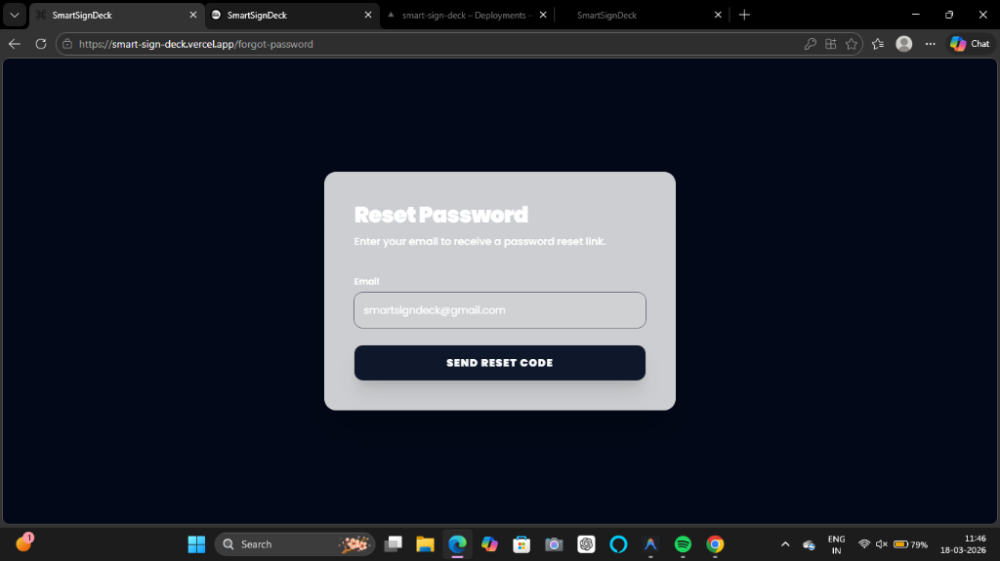
***Description***: The password recovery flow starts with email verification. Upon submission, the system validates the account existence and triggers a secure SMTP-based recovery process.

<b>e. OTP Verification Stage</b>
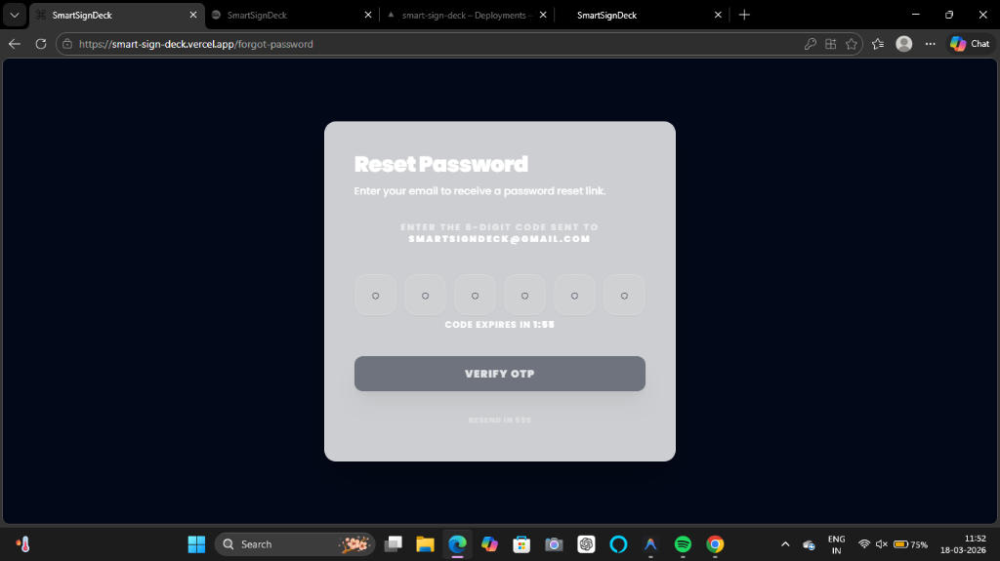
***Description***: A dedicated 6-digit OTP interface ensures that only the email owner can proceed with the reset. The UI features a real-time countdown timer (synchronous with the backend expiry) and specialized `PinInput` fields for high-usability digit entry. Once verified, the user is transitioned to the secure "New Password" stage.

<b>f. New Password Entry</b>
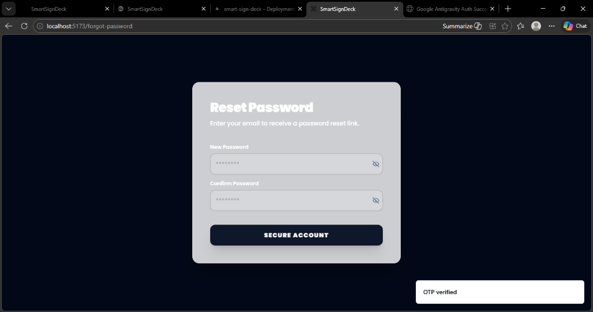
***Description***: After OTP verification, the user is prompted to set a new password. The form includes "New Password" and "Confirm Password" fields with masked input and a visibility toggle. A "Secure Account" button finalizes the reset.

<b>g. Password Strength Validation & Success</b>
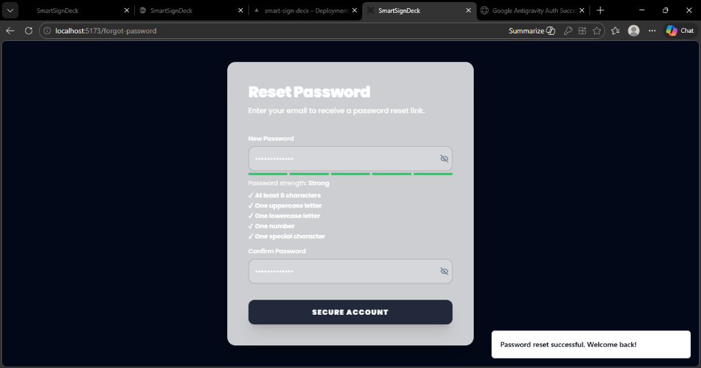
***Description***: The system includes a real-time **Password Strength Indicator** that evaluates criteria (8+ characters, uppercase, lowercase, number, special character). The progress bar turns green upon achieving "Strong" status. A success toast ("Password reset successful. Welcome back!") confirms the operation.

<b>h. Post-Reset Dashboard Landing</b>

***Description***: After a successful password reset, the **Super Admin** is automatically redirected to the main Dashboard. This confirms end-to-end functionality: from email entry → OTP → password reset → authenticated session. The sidebar reveals the full **Super Admin** navigation including Templates, Screens, Playlists, Analytics, Collaboration, Users, Recycle Bin, Requests, Organizations, and Chat.

<b>3. Administrative Command Centers</b>

<b>a. Super Admin Dashboard (The System Brain)</b>

***Description***: The **Super Admin Dashboard** serves as the centralized command center for the entire SmartSignDeck ecosystem. It provides real-time statistics on total organizations, active screen counts, and system-wide performance metrics. The interface features a clean, professional dashboard layout with "Welcome Back" messaging and quick-access cards for system-wide health monitoring.

<b>b. Organization Management (Multi-Tenant Control)</b>

***Description***: To support the **Multi-Tenant** architecture, this module allows Super Admins to manage distinct business entities. Each organization acts as a secure container for its own users, screens, and templates. The UI provides a high-level grid view where Admins can create new tenants, manage ownership, and monitor active subscriptions.

<b>4. Administrative Suite (Org Admin)</b>

<b>a. Screen Management & Status Monitoring</b>
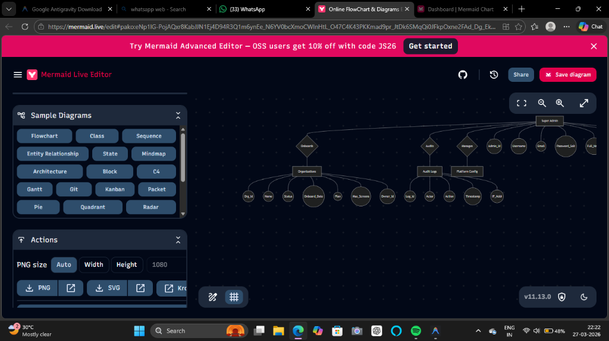
***Description***: The **Screen Management** interface allows Organization Admins to monitor their hardware fleet in real-time. Each screen displays its current heartbeat status (Online/Offline/Syncing), allowing for immediate troubleshooting if a physical TV goes disconnects. Admins can push layout updates to individual screens or entire groups instantly.
<b>5. Creative Suite (Designer Tools)</b>

<b>a. Collaborative Canvas Editor (WYSIWYG)</b>

***Description***: The **Collaborative Designer** is the engine that drives your project. It features a full-screen interactive canvas built with **Fabric.js**. Designers can create "Zones" for different media types (video, image, text), move them using drag-and-drop, and resize them on the fly. Because of the **Socket.io** integration, multiple designers can see each other's changes in real-time, preventing layout conflicts.

<b>6. Specialized Insights (Advertiser Role)</b>

<b>a. Real-time Impact & Analytics Dashboard</b>

***Description***: Advertisers are provided with a dedicated view that tracks **Proof-of-Play**. This dashboard utilizes data from the `PlaybackLog` collection to show how many times an ad was rendered, for how long, and on which specific screens. The interface uses interactive charts to demonstrate demographic distribution (Age/Gender) and high-traffic times, allowing for data-driven campaign optimization.

<b>7. Team Communication & Social Tools</b>

<b>a. Integrated Collaboration Hub</b>

***Description***: To fulfill the "Collaborative" promise of the SmartSignDeck platform, a real-time chat system is integrated directly into the workspace. This allow designers, admins, and advertisers to communicate without leaving the platform. Messages are synchronized instantly across all authenticated clients, supporting team wall messages and project-specific notifications to ensure everyone is updated on layout changes.

---

<b>9. Scopes and Limitations</b>
- <b>Scope</b>: Multi-tenant security, real-time WYSIWYG editing, 3-layer scheduling fallback.
- <b>Limitations</b>: Currently requires persistent internet for initial playback initialization; touch-interactivity is a secondary priority.

<b>10. Future Expansion</b>
The <b>SmartSignDeck</b> platform is designed for horizontal scalability, with several high-impact modules planned for future development to enhance the Admin and User experience:

1.  <b>AI-based Audience Detection</b>: Integration with camera hardware to provide real-time engagement analytics using computer vision.
2.  <b>Content Approval Workflow</b>: For the <b>Admin</b> role, implementing a "Review & Approve" gate where collaborators submit designs for verification before they can be scheduled on live screens.
3.  <b>Intelligent Playback Insights</b>: AI-driven dashboard for Admins that suggests optimization strategies based on under-utilized screens or high-performing ad hours.
4.  <b>White-Label Customization</b>: Allowing Organization Admins to apply custom branding (logos and color schemes) to their specific dashboard view.
5.  <b>Granular Permission Delegation</b>: Enabling Admins to assign sub-roles (e.g., "Screen Operator" or "Template Master") for more precise control over large teams.
6.  <b>Advanced Edge Caching</b>: Enhancing the Player engine with Service Workers (PWA standards) for robust offline-first playback without persistent internet.
7.  <b>Programmatic Ad Exchange</b>: Enabling <b>Advertisers</b> to link with third-party DSPs (Demand Side Platforms) to automatically fetch and display external ad inventory.
8.  <b>Automated A/B Testing</b>: Tools for Advertisers to run split tests on content variations across identical screens and compare performance via automated playback logs.
9.  <b>External Contextual Triggers</b>: Implementation of "Dynamic Content" where ads change automatically based on weather, stock indices, or localized social media trends.
10. <b>Real-time ROI Dashboard</b>: Direct financial reporting for Advertisers to track "Value Per Impression" based on predefined campaign costs and rendering duration.

<b>11. References and Bibliography</b>
- *World Digital Out of Home (WOO) Standards.*
- *Socket.io Enterprise Integration Whitepapers.*
- *Fabric.js Object-Oriented Canvas Programming.*

---

<b>12. Conclusion</b>
The <b>SmartSignDeck</b> system successfully addresses the limitations of traditional digital signage by introducing a cloud-based, real-time, and intelligent playback architecture. By utilizing modern web technologies like <b>React</b>, <b>Node.js</b>, and <b>Socket.io</b>, the platform provides a seamless collaborative environment for designers and a reliable, high-performance execution engine for physical displays. The intelligent layout fallback and automated media normalization ensure that screens remain visually perfect without manual intervention. This project demonstrates the practical application of <b>MERN</b> stack principles in solving real-world advertising challenges, offering a scalable solution for organizations of all sizes.

