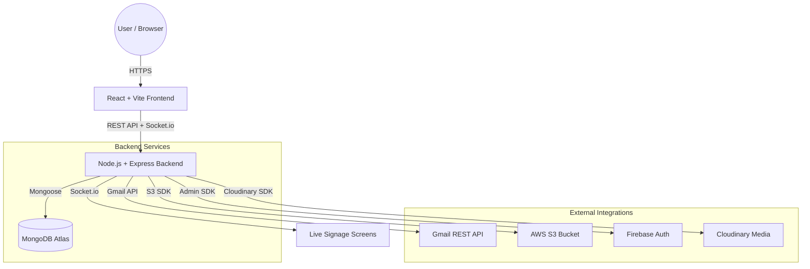
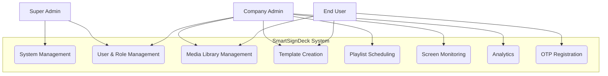
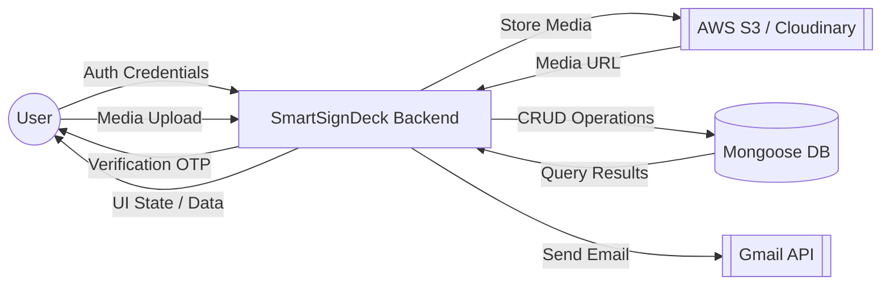
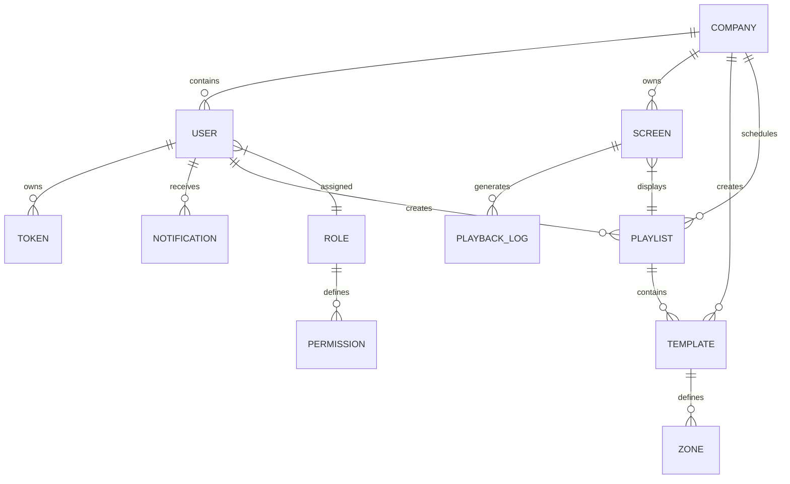
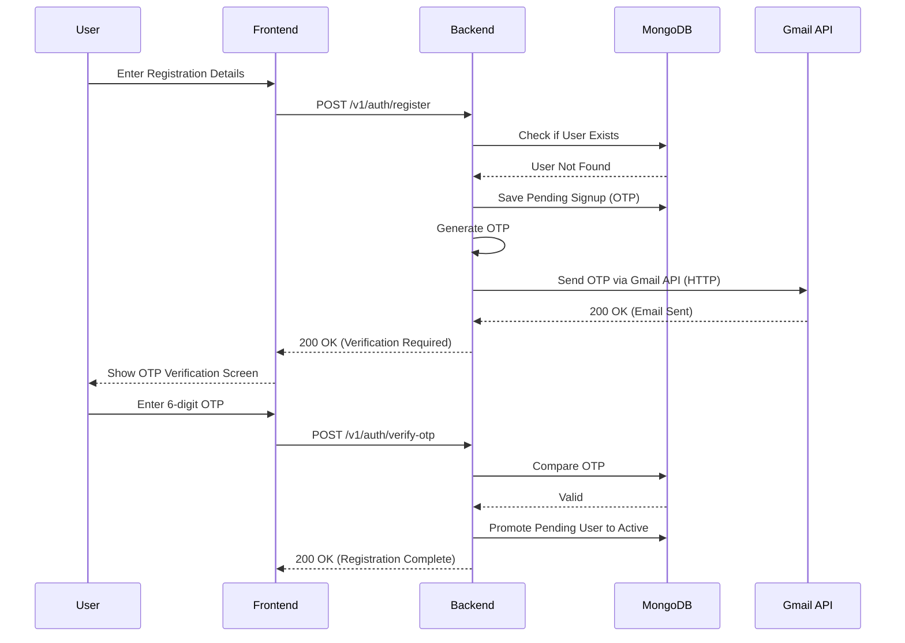

# SmartSignDeck System Documentation

This document provides a technical overview of the SmartSignDeck system through various architectural and data flow diagrams.

---

## 🏗️ System Architecture Diagram
The architecture follows a modern MERN-like stack with external integrations for media and communication.

---

## 👤 Use Case Diagram
Describes how different types of actors interact with the system.

---

## 🔄 Data Flow Diagram (DFD Level 1)
Shows the flow of information between processes and external entities.

---

## 📊 Entity Relationship (ER) Diagram
Represents the database structure and relationships between core entities.

---

## 🧪 Sequence Diagram: User Registration & OTP
Illustrates the flow we've been debugging: Registration via Gmail API.

